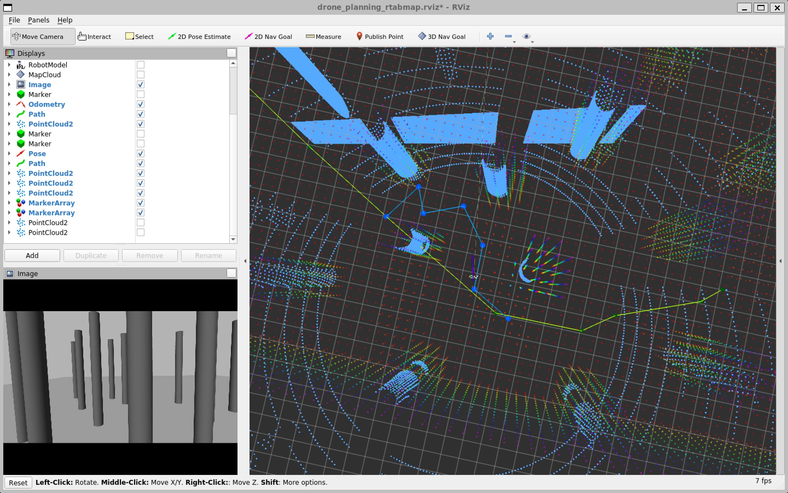
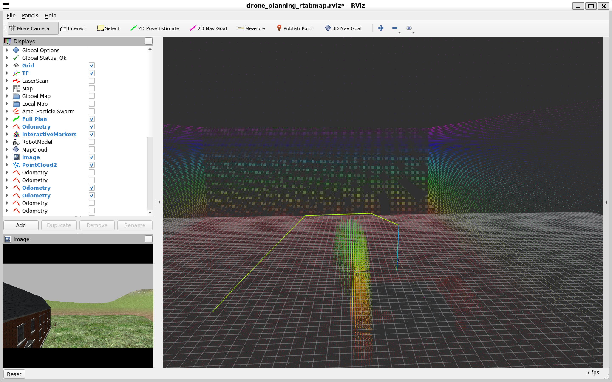

## drone_planning_ros

1. Integrate with drone simulation using PX4 and Gazebo.
2. Integrate with multirotor keyboard and communication from XTDrone.
3. Integrate with 3D SLAM rtabmap_ros.
4. Integrate with planner from sampling-based-Guided.

# Installation

1. Install ROS Noetic, rtabmap_ros, sampling-based-Guided, MAVROS, PX4, and Gazebo.

2. Clone drone_planning_ros into your ROS workspace

```bash
git clone https://github.com/KorawitGems/drone_planning_ros.git
```

# Run

```bash
roslaunch drone_planning_ros px4_mavros_gazebo.launch
roslaunch drone_planning_ros xtdrone_keyboard.launch
roslaunch drone_planning_ros slam_3d_lidar.launch
roslaunch drone_planning_ros sampling_planning.launch
```

<p align="center">
  
</p>

The planner can avoid large obstacles up to 10x10x10 m^3.

<p align="center">
  
</p>
